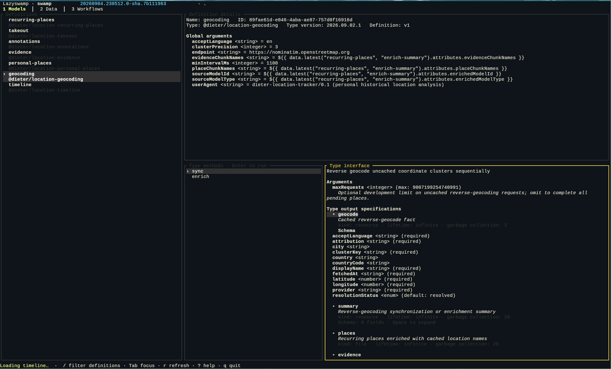
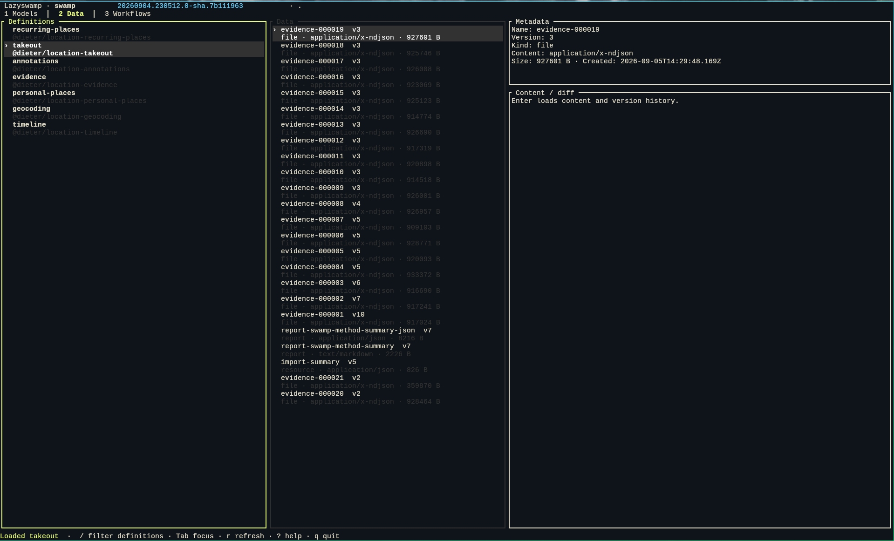
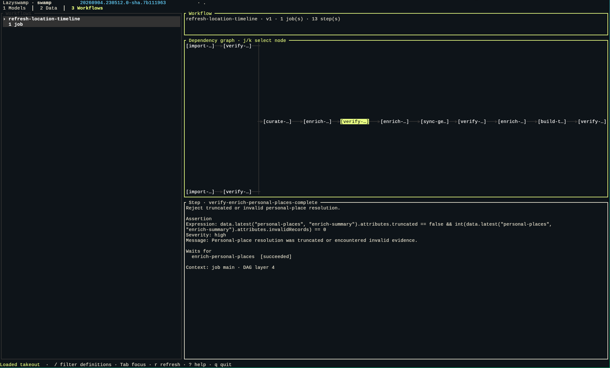

# Lazyswamp

Lazyswamp is a terminal user interface for [Swamp](https://swamp.club), inspired
by [Lazygit](https://github.com/jesseduffield/lazygit).

I built it because I found it too cumbersome to run the various swamp CLI
commands to find a model, inspect it, to view its method parameters, to list its
data, to view the data, etc, etc. The main goal of lazyswamp is simply to show
everything I need in a single UI that is easy to navigate.

Secondarily, you can also execute method runs with custom parameters from the
TUI.

## Screenshots

### Models



### Data



### Workflows



## Features

- Browse & search model definitions, and inspect their type interface, methods,
  arguments, and output specifications from the Models screen.
- Validate, review, run, monitor, and cancel model methods. Every run requires
  review; destructive-looking methods also require the model name.
- Browse artifact metadata and content, select historical versions, view data
  and compare JSON structurally or UTF-8 text line by line.
- Browse workflows as routed DAGs with arrows, select individual steps, and
  inspect their dependencies, conditions, task types, and inputs.

Lazyswamp is deliberately read-only apart from running and cancelling model
methods. It does not create models or rename, prune, garbage-collect, or delete
data.

## Requirements and installation

- Rust 1.85 or newer
- `swamp` installed and available on `PATH`
- An initialized local Swamp repository

Install from a clone:

```sh
cargo install --path .
```

Run Lazyswamp inside a Swamp repository:

```sh
lazyswamp
```

Or select the repository and CLI explicitly:

```sh
lazyswamp --repo-dir /path/to/repo --swamp-bin /path/to/swamp
```

## Navigation

| Key                   | Action                                                 |
| --------------------- | ------------------------------------------------------ |
| Arrow keys or `j`/`k` | Move the active selection                              |
| `Tab`                 | Cycle definition, type method, and output focus        |
| `1`, `2`, `3`         | Open Models, Data, or Workflows                        |
| `Enter`               | Open, load, validate, or confirm                       |
| `/`                   | Filter the current definition or workflow list         |
| `r`                   | Refresh the current view                               |
| `[` / `]`             | Select a data version, or a type output                |
| `Space`               | Expand or collapse the selected type output schema     |
| `a` / `b`             | Mark the two versions to compare                       |
| `c`                   | Cancel the active method run                           |
| `?`                   | Open contextual help                                   |
| `Esc`                 | Close a dialog or hide the active method run log       |
| `q`                   | Quit                                                   |

Method inputs support common JSON Schema types and constraints. The Models
screen formats names, types, defaults, maxima, required markers, and
descriptions as readable rows; nested fields are indented. Schemas using
references, composition, or conditionals show a concise complex-schema fallback
in the details view but still use the raw JSON editor when running the method.
Fields marked `writeOnly` or `format: password` are masked and redacted from the
review screen. Inputs are held only in memory and sent to Swamp as JSON over
stdin.

The Models screen distinguishes a YAML model definition from its TypeScript type
interface: a definition supplies its identity and global arguments, while the
type supplies methods, argument schemas, and output specifications. Running a
method targets the selected definition. Per-method definition overrides are not
shown because `swamp model get --json` does not expose them; reading model YAML
directly would violate Lazyswamp's CLI-only integration boundary.

Content larger than 1 MiB requires confirmation before loading. Binary content
shows metadata but is not rendered or compared.

## Design decisions

Lazyswamp uses Rust and Ratatui because they provide a portable single binary,
typed response handling, and mature terminal widgets. Go with Bubble Tea and
TypeScript with Ink were considered; both are viable, but Rust best fits the
single-binary and strongly typed CLI-adapter goals selected for this project.

All operations go through the supported `swamp` CLI with JSON retrieval output.
This follows Swamp's architecture and data guidance: models own typed actions,
while data is queried through Swamp's versioned catalog. Reading `.swamp/`
directly was rejected because it would bypass datastore abstractions and couple
the UI to private storage layouts.

The interface renders before startup probes finish. Model and workflow searches
run alongside one repository-wide query for the latest data metadata. Lazyswamp
uses the enriched model-search metadata for methods and global-argument
schemas, then preloads only workflow definitions and unique model type
descriptions with an adaptive pool of 4–12 workers. This avoids one `model get`
process per model while retaining full output schemas. Definition retrieval is
lazy when search does not include the configured global arguments, and remains
required to re-check destructive invocations. Artifact content remains on demand
because it can be large. Preloading every definition was considered, but is
inferior now that search supplies the shared method metadata.

Workflow graphs are rendered from `swamp workflow search --json` and
`swamp workflow get --json`. Capturing Swamp's built-in `--graph` text was
considered, but rejected because static terminal output cannot support node
selection, responsive layout, or a details panel. Lazyswamp uses a native
layered layout with routed connectors and arrowheads because workflows are DAG
orchestrators over model methods, as described by Swamp's `design/workflow.md`.

The first release supports local repositories only. Remote `swamp serve`
connections, workflow execution and history, reports, model creation, a complete
JSON Schema UI, concurrent runs, crates.io publication, and prebuilt release
binaries were considered but deferred to keep the initial safety and browsing
flows focused.

## Development

```sh
cargo fmt --check
cargo clippy --all-targets --all-features -- -D warnings
cargo test --all-targets
cargo build --release
```

Tests use client doubles and checked-in response fixtures; they do not require
network access or a live Swamp repository.

Lazyswamp is licensed under the [MIT License](LICENSE).
